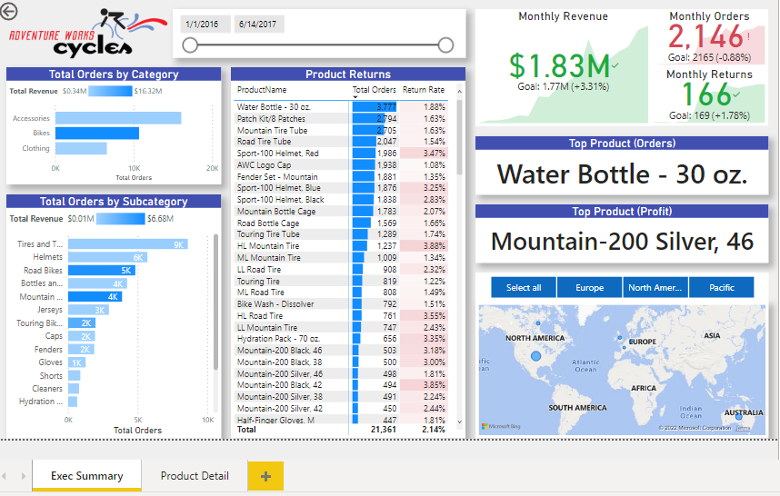
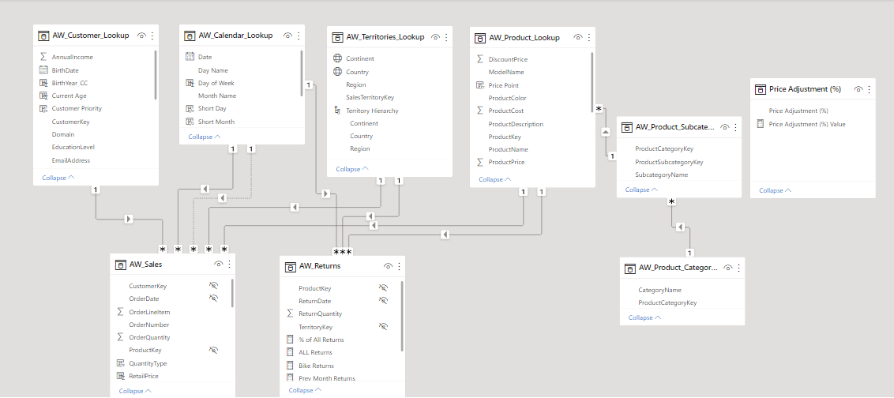

<h1>AW Report 📊</h1>

<h2>Introduction</h2>

In this project, I will create a business report. This report has two pages that contain all the stakeholder's demands and the KPI's necessary for their business performance overview.

<h2>Scenario</h2>

Directors from Adventure Works believe is key for their business to keep all the KPI's easy to keep track of it. To maximize efficiency in their decisions they required a report with all critical information about their current sales performance worldwide. 

<h2>Business Demands</h2>

- Create a report with all Business KPI's.
- Create a page focusing on Summary Info.
- Create a page with Product Sales Details.

<h3>Final Report Pages with the following deliverable's:</h3>

1.  Summary: Most Returned Products by Category, Total Orders by Category, Total Orders by Subcategory, KPI's (Total Revenue), Sales Perfomance by Location.
2.  Product Details: Week Profit, Week Itens Returns

<h3>1. Summary of Analysis</h3>

*Top Product*

- The number one product in sales was the Watter Bottle - 30oz.
- Total Orders: 3,777 with 404 monthly orders.
- Total Revenue: $48.084. 
- Location with most sales: North America (1,435 units sold).

*Top Revenue Product*

- The product with more revenue was the bike, Road-750 Black.
- Monthly Orders: 465 units sold.
- Total Revenue: $536.750.
- Location with most sales: Oceania (Australia).

*Locations Sales Performance*

- The North American region was the number one in sales and profit. 
- In the US the sales reach over 5.5 million USD in profit. 
- The Oceania was the second-best region in sales, reaching 5 million USD in profit.

<h3>2. Supporting visualizations and keys findings</h3>

- *Summary Page*

- *Product Detail Page*

- *Data Model*

